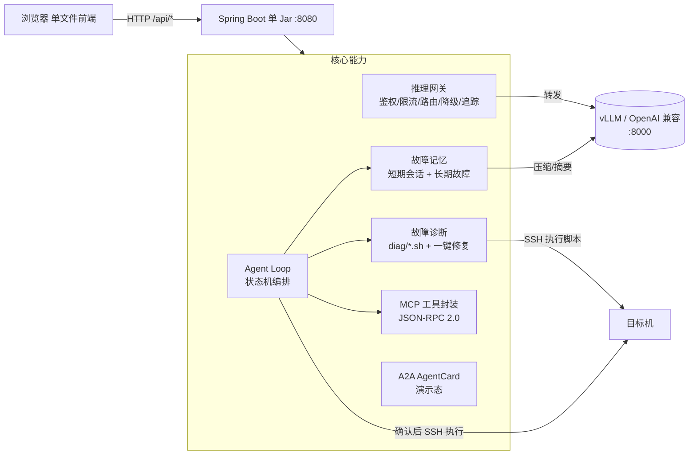

# AI Infra 系统 MVP

> 一个**可私有化部署**的 AI 基础设施运维平台：把推理网关、故障诊断、故障记忆、Agent Loop 编排与 MCP 工具封装整合到一个轻量 Spring Boot 单 Jar 里，前端是零构建的单文件页面。
>
> 定位：帮中小团队把「本地/私有化部署的 vLLM 等推理服务」管起来——网关鉴权限流、一键诊断、历史故障记忆召回、人机协同的自动修复建议。

---

## 为什么做这个

通用服务器巡检满天飞，但「AI Infra（推理服务 / GPU / k8s 调度）」的运维是另一回事：

- 推理服务挂了，是 OOM、掉卡、还是路由错？
- 同一个故障第二次出现，能不能直接召回上次的修复经验？
- 让 Agent 自动修，但**必须在人确认后才执行**（数据不出域、操作可追溯）。

本项目把这几件事做成一套**可运行、可演示、可私有化**的 MVP。

---

## 架构



**部署拓扑（典型）**

```
┌─────────────┐      ┌──────────────────────┐      ┌─────────────────┐
│  浏览器      │─────▶│  AI Infra MVP (Jar)   │─────▶│  vLLM 推理后端   │
│ 前端单文件   │      │  :8080                │      │  :8000          │
└─────────────┘      │  ├ 网关/诊断/记忆/...  │      └─────────────────┘
                     │  └ SQLite (inspection.db)     │
                     └──────────────────────┘
```

---

## 能力矩阵

| 能力 | 状态 | 说明 |
|------|------|------|
| 推理网关（Tier-1 轻量） | ✅ 已实现 | API Key 鉴权 + 全局/Key 级 QPS 限流 + 并发上限 + 多后端优先级路由 + 重试 + **自动降级**（识别「假成功」响应）+ 调用追踪 |
| 故障诊断 + 一键修复 | ✅ 已实现 | `diag/*.sh` 输出结构化 JSON（level/message/suggestion），后端自动生成修复命令前端可一键执行 |
| 故障记忆（长短期） | ✅ 已实现 | 短期=会话上下文；长期=故障案例库，支持**自然语言召回**（英文 token + 中文 bigram 打分），可用本地 LLM 压缩沉淀 |
| Agent Loop | ✅ 已实现 | 状态机：`诊断 → 记忆召回 → LLM 建议 → WAIT_CONFIRM → 人确认后执行 / 中止` |
| MCP 工具封装 | ✅ 已实现 | 扫描脚本目录生成 JSON Schema，暴露 JSON-RPC 2.0 `tools/list` / `tools/call` |
| A2A（Agent-to-Agent） | 🟡 演示态 | 输出标准 AgentCard，task 创建/查询为演示实现，协议骨架已就绪 |
| 脚本交付 | ✅ 已实现 | 脚本目录 `@desc` / `@args` 元信息解析，前端展示参数说明 |
| 批量主机扫描 | ✅ 已实现 | IP 段 / CIDR / 范围 / 列表，SSH 批量探测 |
| Word 报告导出 | ✅ 已实现 | 基于 Apache POI 生成诊断报告 |

> 状态图例：✅ 真实可用　🟡 规划/演示

---

## 技术栈

- **后端**：Spring Boot 3.2.1（Java 17）、Spring JDBC、SQLite、JSch（SSH）、HttpClient（转发 vLLM）、Apache POI（Word）
- **前端**：单文件 HTML（Vue 3 IIFE + Element Plus IIFE + axios），**无需 npm/构建**，直接由 Spring 静态资源托管
- **存储**：SQLite 单文件 `inspection.db`，零外部依赖
- **LLM**：复用本地/远端 vLLM（OpenAI 兼容），记忆压缩/建议生成均走内部通道，无需额外 Key

---

## 快速开始

### 前置条件

- Java 17+（`JAVA_HOME` 或 PATH 中可用 `java`）
- 一个 OpenAI 兼容的推理后端（如本地 vLLM，默认 `http://127.0.0.1:8000`）
- Maven 3.8+（仅构建时需要；也可直接拿已构建的 Jar）

### 构建

```bash
mvn package -DskipTests
# 产物：target/ai-infra-mvp-1.0.0-SNAPSHOT.jar
```

### 配置（可选）

所有配置项均有默认值，**开箱即用**。生产/私有化部署通过环境变量覆盖（见下表），**不要在仓库里硬编码密钥路径**。

| 环境变量 | 默认值 | 说明 |
|----------|--------|------|
| `SERVER_PORT` | `8080` | HTTP 端口 |
| `DB_PATH` | `./data/inspection.db` | SQLite 文件路径 |
| `WEB_STATIC_DIR` | `./web-static/` | 优先于 jar 内静态资源的前端目录 |
| `VLLM_BASE_URL` | `http://127.0.0.1:8000` | vLLM 推理地址 |
| `GATEWAY_GLOBAL_QPS` | `20` | 全局 QPS（0=不限） |
| `GATEWAY_GLOBAL_CONCURRENCY` | `10` | 全局并发上限 |
| `INFRA_SCRIPT_DIR` | `./scripts` | 诊断/交付脚本目录 |
| `AGENT_TARGET_HOST/PORT/USER/KEY` | `127.0.0.1/22/root/` | Agent Loop 执行修复动作的目标机（Key 用环境变量注入） |

### 启动

```bash
# 方式一：前台运行（看日志）
./start.sh

# 方式二：后台运行（生产/演示）
./run.sh
```

启动后访问：**http://localhost:8080**

### 一键体验 Agent Loop

```bash
curl -X POST http://localhost:8080/api/agent/run \
  -H 'Content-Type: application/json' \
  -d '{"issue":"vLLM 服务显存不足，推理请求报错"}'
# 返回 sessionId 与 WAIT_CONFIRM 状态，
# 再调用 /api/agent/confirm 经人工确认后执行修复动作
```

---

## 目录结构

```
ai-infra-mvp/
├── pom.xml                      # Maven 构建（标准 Spring Boot）
├── run.sh / start.sh            # 启动脚本（自动适配 JAVA_HOME）
├── src/
│   ├── main/
│   │   ├── java/com/inspection/ # 后端源码
│   │   │   ├── controller/       # REST 端点
│   │   │   └── service/          # 网关/诊断/记忆/Agent/MCP/A2A
│   │   └── resources/
│   │       ├── application.yml   # 配置（相对路径 + 环境变量）
│   │       ├── schema.sql        # 建表
│   │       └── static/index.html # 前端单文件（Maven 打包进 jar）
│   └── test/                     # 测试
├── scripts/                     # 诊断与交付脚本
│   ├── baseline_check.sh
│   └── diag/                     # diag_api / diag_tcp / diag_gpu / ...
├── docs/                        # 文档聚合（部署/API/复盘）
└── LICENSE
```

---

## API 速览

| 域 | 端点 |
|----|------|
| 网关 | `/api/gateway/config`、`/api/gateway/keys`、`/api/gateway/routes`、`/api/gateway/fallback-logs`、`/api/gateway/route-chain`、`/api/gateway/v1/chat/completions` |
| Agent | `/api/agent/run`、`/api/agent/confirm`、`/api/agent/status` |
| 记忆 | `/api/memory/short`、`/api/memory/long`、`/api/memory/recall`、`/api/memory/compress` |
| MCP | `/api/mcp/tools`、`/api/mcp/call`、`/api/mcp`（JSON-RPC 2.0） |
| A2A | `/api/a2a/agent-card`、`/api/a2a/tasks` |
| 推理 | `/api/inference/status`、`/api/inference/models`、`/api/inference/metrics` |

> 完整字段见各 Controller 源码与 `docs/`。

---

## 开源地址

- GitHub：**<https://github.com/<你的用户名>/ai-infra-mvp>** （请将 `<你的用户名>` 替换为实际账号）
- Gitee 镜像（可选）：**<https://gitee.com/<你的用户名>/ai-infra-mvp>**

欢迎 Issue / PR。如果你也在做 AI Infra 私有化运维，欢迎交流。

---

## License

[MIT](./LICENSE) © AI Infra MVP
